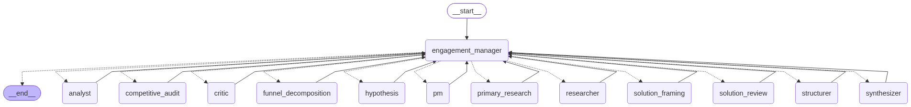

# Multi-Agent PM Research Assistant

An agentic business research/analysis system built on LangGraph. Given a
business problem statement, it classifies what KIND of problem it is,
runs a genuinely different sequence of specialist agents depending on
the answer, and produces either a diagnosis (why did this happen, cited
to real evidence), a product recommendation (what to build, backed by
authoritative sources and competitive context), or both — never
inventing a diagnosis nobody asked for, and never recommending
something a company already ships.

See [ARCHITECTURE.md](ARCHITECTURE.md) for what each agent does and
every guardrail in the system; [FLOW.md](FLOW.md) for how a request
actually moves through them, hop by hop.

## The graph



Flat supervisor pattern — every worker agent's edge points back to
`engagement_manager`, which decides what runs next based on what the
current state is still missing. No agent calls another agent directly;
`researcher` has no idea `analyst` exists. Regenerate this diagram after
changing the graph with:

```python
from graph import build_graph
app = build_graph()
open("docs/graph.mmd", "w", encoding="utf-8").write(app.get_graph().draw_mermaid())
open("docs/graph.png", "wb").write(app.get_graph().draw_mermaid_png())
```

## Agents

- `engagement_manager` — supervisor: routes work via mode-specific ladders, handles loop-backs
- `structurer` — MECE issue tree + `problem_type`/`routing_mode`/anchor-term classification
- `hypothesis` — falsifiable, single-claim hypotheses with kill conditions (diagnostic track)
- `researcher` — web search + page fetch against hypothesis kill conditions (diagnostic track)
- `analyst` — pulls numeric facts per hypothesis, charts only what's comparable (diagnostic track)
- `synthesizer` — per-hypothesis verdicts, source-tier weighted, Pyramid Principle write-up (diagnostic track)
- `funnel_decomposition` — decomposes a PM problem's stated metric into funnel stages before any solution is proposed (PM track)
- `primary_research` — authoritative sources for the ask itself, funnel-targeted queries, company-scoped current-state findings (PM track)
- `competitive_audit` — what named competitors already ship, classified per issue-tree branch (PM track)
- `solution_framing` — candidate solutions from research + competitive audit + funnel verdict, each tied to real evidence (PM track)
- `pm` — RICE-scored PRD-lite from either hypotheses+verdicts or solutions+audit
- `solution_review` — retroactively kills weak PM solutions against the evidence gathered; recomputes MoSCoW over survivors
- `critic` — mode-aware deterministic checks; loops work back to the responsible agent when something's material

Three `routing_mode`s: **diagnostic** (why did this happen), **pm**
(what should we build), **combined** (both). See ARCHITECTURE.md's "The
three routing modes" for the full agent-inclusion table per mode.

## Stack

Python, LangGraph, LangChain, Groq (free tier) for LLM inference — with
an optional second provider (Cerebras, for large-payload calls) that
`config.py` can route any agent to per-entry, with invocation-time
fallback back to Groq if it fails (see the design note below) — Tavily
for search, SQLite for the evidence base, Streamlit for the UI.

## Setup

```
pip install -r requirements.txt
copy .env.example .env   # fill in GROQ_API_KEY and TAVILY_API_KEY; CEREBRAS_API_KEY is optional
```

Run the UI:

```
streamlit run app.py
```

Or the CLI (writes `data/brief_<run_id>.md` and prints it):

```
python run.py
```

A run takes 5-10 minutes on the free tier — Groq's rate limits mean the
retry/backoff decorator (`utils/retry.py`) does real work mid-run, not
just on rare failures. The Streamlit UI streams progress per agent as it
completes (queries planned, pages fetched, evidence inserted/rejected,
solutions killed) rather than sitting silent for that whole window.

### The Streamlit app

- Four one-click example problems (product + diagnostic + regulatory) or
  your own problem statement
- Live streaming via `app.stream()`, not `invoke()` — each agent's
  completion, and the counters it logged (`utils/logger.py`'s
  `run_logger`), render as it happens
- The rendered brief reuses `tools/brief.build_markdown_brief` directly
  — the UI does not reimplement any rendering or business logic, it only
  drives the graph and displays what the agents already produced
- A sidebar of past runs (`data/brief_*.md`), viewable without
  re-running
- An **Evidence explorer** tab: pick a `run_id`, browse every finding
  and fact the run actually stored — claim, source name, source URL,
  source tier — via `tools/sql_query.py`'s read-only SQL tool. This is
  the provenance story made visible: every claim in a brief traces back
  to a real page, and this is where you can click through to it.

## Evidence base — "no source, no storage"

`data/business.db` is not seeded with any company data. It holds two
tables, populated only at runtime as agents gather real evidence, each
row scoped to a `run_id`:

- **findings** — qualitative evidence: a `claim`, a `stance`
  (`supports` / `contradicts` / `context`), and the `source_url` it came
  from.
- **facts** — numeric evidence: an `entity`/`metric`/`value`/`unit`,
  opportunistic (a page with no numbers is normal, not a failure). Never
  deduped — two sources reporting the same figure is signal, not noise.

Both tables enforce `source_url NOT NULL` as a DB constraint, not just a
prompt instruction — a row with no source cannot be inserted, full stop.
Provenance is attached by Python, never by the model:
`tools/evidence_extractor.py` asks the LLM only for
`claim`/`stance`/`metric`/`value`/etc — the model is explicitly told not
to supply `source_url` or `source_name`. Python attaches those from the
page it actually fetched, plus `run_id`/`hypothesis_id` from state,
before validating (unit whitelist, float-castable value, non-empty
source, grounded-in-the-actual-page-text) and inserting. Rejections are
logged, never dropped silently without a trace. A model can hallucinate
a URL; it can't hallucinate a variable Python assigned.

See [ARCHITECTURE.md](ARCHITECTURE.md#the-evidence-base) for the full
schema and every guardrail enforced on the way in.

## Design note: multi-provider routing, and why fallback lives at invocation time

Groq's free tier is fast but tight on tokens-per-minute. `config.py`'s
`MODELS` lets any agent entry be routed to Cerebras instead (`provider:
"cerebras"`) for its much larger daily budget, on a per-entry basis — an
earlier configuration routed `competitive_audit`'s classify step,
`solution_framing`, and `funnel_decomposition` there; the current
`MODELS` happens to run everything on Groq, but the routing and fallback
machinery described below is exercised the moment any entry's
`provider` is switched back to `"cerebras"`, not dead code.

Running with Cerebras entries active surfaced three distinct
provider-failure modes in two days of real runs: a stale model name
(404), an account quota issue (402 payment required), and — separately
— Groq's own daily token ceiling. Each one is a different HTTP status
from a different provider, and the first fallback implementation only
checked for failure at CLIENT CONSTRUCTION time (`ChatCerebras(...)`
raising, or the API key being unset) — which does nothing for a model
name Cerebras doesn't recognize or a payment-required account, both of
which construct a client object fine and only fail once actually
invoked. Two of the three failure modes went straight through that gap
and killed the run at the first Cerebras-routed node.

The fix, in `config.invoke_llm`: catch provider errors at INVOCATION
time, not just construction. Any non-rate-limit 4xx/5xx from a non-Groq
provider is logged clearly and retried once on that entry's
`groq_fallback_model` before it's allowed to propagate. Rate limits are
deliberately left alone — those already have a working backoff decorator
(`utils/retry.py`, extended to recognize both the Groq and OpenAI-
compatible exception hierarchies, since Cerebras runs on an
OpenAI-compatible client) and retrying a 404 a second time wouldn't
help anyway. `DISABLE_NON_GROQ_PROVIDERS=1` in `.env` forces every agent
onto Groq in one line, for when Cerebras is having a bad day and it's
not worth debugging live.

## Known limitations

The system enforces two kinds of things about every claim it makes:
that it's **traceable** (a real, fetched source backs it — enforced at
the DB layer, code-checked, not just prompted for) and that certain
**fields are present** (a constraint explanation exists, a citation
resolves to a real row, a required label was set). It does not, and
structurally cannot, verify that an argument is **sound** or that a
recommendation is **novel**.

- **Constraint compliance is checked for presence, not soundness.** A
  solution can rationalize its way past a stated constraint; in one run,
  given the constraint "cannot increase customer incentive spend," the
  system recommended a bundled-discount offer and justified it as not
  increasing incentive spend "since it focuses on offering value through
  bundled products" — discounting *is* incentive spend, and the
  justification doesn't survive scrutiny. `works_within_constraint` is
  checked for being non-empty, not for being right.
- **Evidence quality varies widely.** Everything is traceable to a
  source, but sources are often blogs and app-store reviews rather than
  primary material. Provenance is guaranteed; substance is not — see
  `utils/source_tier.py` for how the system weighs this, but weighing
  isn't the same as having better evidence to weigh.
- **Current-state detection is unreliable.** `agents/primary_research.py`
  gathers current-state evidence specifically so `agents/solution_framing.py`
  can avoid recommending something the company already ships. It has
  still let a recommendation through for something a named competitor
  had shipped for years — the search simply didn't surface that
  particular fact. Not a logic bug (status=="exists" evidence is
  correctly excluded); a coverage gap in what got found, which no code
  check can guarantee against.
- **Competitive evidence is not jurisdiction-gated.** A regulatory or
  legal citation found for one market can be surfaced as evidence about
  a different one if the search doesn't distinguish them — a US
  ordinance cited as evidence about an Indian market, for instance.
  Nothing currently checks that a source's jurisdiction matches the
  problem's stated geography.
- **The system can verify that a claim is traceable and that a required
  field is present. It cannot verify that an argument is sound or that a
  recommendation is novel.** That part still needs a human reviewing the
  brief before it ships.

## Next

- **`analyst` routing mode** — a dataset/table is supplied directly and
  the answer must come only from it, no external research: KPIs and a
  dashboard out, not a cited brief. Not built yet; deliberately not
  scaffolded in the current enum either, to avoid a public repo carrying
  dead-code-shaped placeholders for a mode nothing exercises.
- **Better retrieval targeting.** `primary_research`'s funnel-stage and
  current-state query construction moved from LLM-planned to code-built
  this round because the LLM version demonstrably didn't target what it
  was shown — there's more of that pattern to apply elsewhere (competitor
  query planning, authoritative-source targeting).
- **Bring-your-own-evidence mode.** The single most common way a funnel
  stage ends up `"undetermined"` is that the evidence to resolve it is
  internal — a company's own analytics, support tickets, or session
  replays — and public search structurally cannot find it.
  `funnel_decomposition` already asks for exactly this
  (`evidence_locatability: "internal"`, `instrumentation_plan`) as its
  honest answer when it can't be resolved from the public web. A mode
  where a user supplies that internal data directly — a CSV of funnel
  drop-off rates, a support-ticket export — would let the same
  `solution_framing`/`pm` machinery reason over real internal evidence
  instead of stopping at "instrument this and come back."

## Example output

A real run (`python run.py`, PM mode, no fixtures/mocks) against:

> Nykaa's app sees high browsing and add-to-cart activity, but a large
> share of users abandon before completing checkout. Recommend what
> Nykaa should build to improve checkout completion among users who
> have already added items to their cart.

Worth noting what this run actually did, not just what it output: it
killed 5 of 6 candidate solutions for lacking company-specific evidence
(`solution_review`), found zero competitor evidence for Flipkart or
Amazon and said so rather than omitting them, and the only feature that
survived is an instrumentation recommendation — a legitimate output when
the evidence doesn't distinguish where the drop is happening, not a
failure. This is the "Known limitations" section above, in action.

<details>
<summary>Full brief (click to expand)</summary>

```markdown
# Nykaa's app sees high browsing and add-to-cart activity, but a large share of users abandon before completing checkout. Recommend what Nykaa should build to improve checkout completion among users who have already added items to their cart.

**Mode:** pm | **Problem type:** product | **Constraint:** (none stated)

## Where's the drop? — % of carts that convert to a completed purchase (checkout completion rate) among Nykaa app users who have added items to their cart

| Stage | Definition | Evidence needed | Locatability |
|---|---|---|---|
| Checkout Initiation | User taps the 'Checkout' button from the cart screen and is taken to the first checkout page (order summary). | Analytics showing a steep drop between the 'Add-to-Cart → Checkout button click' event and the first form-load event; app-store reviews or forum posts mentioning "checkout button does nothing" or "gets stuck after I tap checkout". | internal |
| Form Completion | User fills in required shipping/billing details (address, phone, email) and taps 'Continue/Next'. | Page-level funnel metrics (form view → form submit) plus qualitative signals such as public reviews complaining about "too many fields", "auto-fill doesn't work", or "form crashes". | internal |
| Payment Selection & Authorization | User chooses a payment method, enters payment credentials (or selects a saved method), and the payment gateway processes the transaction. | Payment-gateway logs or internal conversion data showing "Place Order → Success" drop; public evidence such as app-store reviews mentioning "payment keeps failing", "UPI not working", or "card gets declined repeatedly". | internal |
| Order Confirmation | User sees the final order-confirmation screen (order number, receipt) and the app registers the transaction as completed. | Internal event tracking of 'payment success' vs. 'confirmation screen shown'; public signals like reviews stating "no order confirmation after payment" or "app shows loading forever after I pay". | internal |
| Post-Checkout Follow-through | User receives post-purchase communication (email/SMS receipt, delivery ETA) and does not return to cancel or raise a dispute within a short window. | Support-ticket volume and cancellation rates shortly after checkout; public evidence such as forum threads about "order got cancelled automatically" or "receipt never arrived". | internal |

**Where the drop is:** Payment Selection & Authorization

## What competitors do

### Competitors with no evidence found
- **Flipkart**: no evidence found
- **Amazon**: no evidence found

## What Nykaa already has

### ‎Nykaa – Makeup/Beauty Shopping App - App Store
- Buy products that are 100% genuine & reliable, sourced directly from the brands. — [‎Nykaa – Makeup/Beauty Shopping App - App Store](https://apps.apple.com/in/app/nykaa-makeup-beauty-shopping/id1022363908)
- Buy cosmetics online at the best prices & avail discounts with India's leading beauty shopping app. — [‎Nykaa – Makeup/Beauty Shopping App - App Store](https://apps.apple.com/in/app/nykaa-makeup-beauty-shopping/id1022363908)
- Makeup products: Get the best make-up products online at low prices. — [‎Nykaa – Makeup/Beauty Shopping App - App Store](https://apps.apple.com/in/app/nykaa-makeup-beauty-shopping/id1022363908)
- Browse through our makeup store app to shop for your favorite lipsticks, mascaras, lip glosses, eyeliners, foundations, etc. — [‎Nykaa – Makeup/Beauty Shopping App - App Store](https://apps.apple.com/in/app/nykaa-makeup-beauty-shopping/id1022363908)
_(+2 more from this source, omitted for brevity)_

## Considered and dropped

### Killed on review
- **Expand UPI & Wallet Payment Suite**: No company-specific evidence shows payment failures are a real problem here.
- **One-Click Tokenized Payments**: Evidence is empty; we cannot confirm long entry times cause abandonment for this company.
- **Real-Time Payment Gateway Health Indicator**: Without evidence the claimed confusion over failures isn't proven for our platform.
- **Automatic Payment Method Fallback**: No data demonstrates gateway timeouts are a significant drop-off cause for us.
- **Pre-Checkout Payment Method Validation**: Lacks any company-specific proof that pre-checkout validation would rescue orders.

## Recommendations
North-star metric: **checkout completion rate (orders per cart)**

### 🔍 INSTRUMENT — [Must] Payment Funnel Instrumentation
Track events: payment method selection, payment submission, gateway response (success/failure), and UI error display timestamps.

**What to measure:** Track events: payment method selection, payment submission, gateway response (success/failure), and UI error display timestamps.
**At stage(s):** Payment Selection & Authorization
**Result that would identify the drop:** If the drop rate spikes between 'payment submission' and 'gateway response' events, the bottleneck is at the gateway processing; if it spikes between 'method selection' and 'submission', the issue is UI/validation.

**Funnel stage:** Payment Selection & Authorization

**Parity with competitors** — does not differentiate

**RICE:** reach=0, impact=0.25, confidence=1.0, effort=0.5 → **0.0**

**Success metric:** If the drop rate spikes between 'payment submission' and 'gateway response' events, the bottleneck is at the gateway processing; if it spikes between 'method selection' and 'submission', the issue is UI/validation.
**Guardrail metric:** not applicable

**Validation plan:** cohort — ?; duration — ?; success threshold — ?
Tests: Lack of granular data on where users drop within the payment step hampers targeted fixes.

**Evidence strength:** instrumentation

## What we could not establish
- solution 'S6' ('Payment Funnel Instrumentation') has zero supporting finding_ids — it is exploratory, not evidence-backed.
- No evidence found for competitor: Flipkart
- No evidence found for competitor: Amazon
```

</details>

Every claim above is traceable to a real fetched page — open the Streamlit app's Evidence explorer tab and select this run's `run_id` to see the source URL behind each one.
